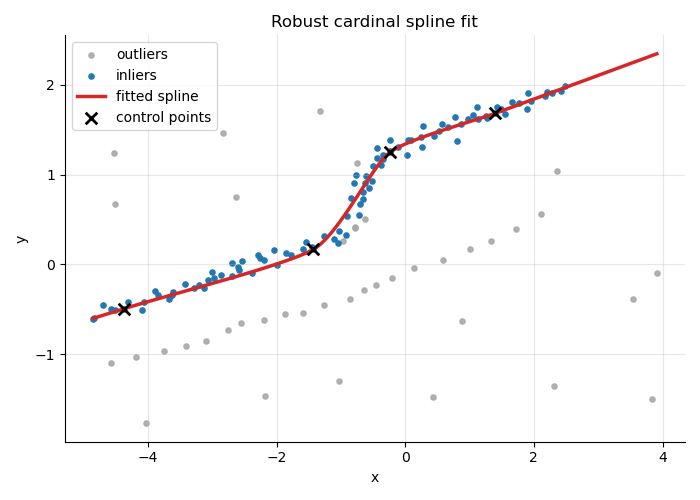

# robust-spline-fitter

A Python library, implemented in C++ for speed, that robustly fits a cardinal spline to noisy 2D `(x, y)` data using RANSAC. Only 2D data is supported for now.



## Install

From source:

```
pip install .
```

This builds the C++ extension via CMake and installs the `robust_spline_fitter` package. You'll need a C++17 compiler and CMake 3.16+ available.

## Quick start

```python
from robust_spline_fitter import CardinalSplineRegressor

model = CardinalSplineRegressor(control_points=4, tries=50000)
model.fit(x, y)  # x, y: sequences of floats

y_pred = model.predict(x_query)
```

See [examples/example.py](examples/example.py) for a full example.

## How it works

Candidate splines are built from randomly sampled control points (RANSAC), and each candidate is scored by how many of the input points fall within `threshold` distance of the curve. The best-scoring candidate is kept. Because the search runs in compiled C++, it stays fast even with a large number of `tries`.

## Key parameters

- `tension`: cardinal spline tension in `[0, 1]`. `0` gives a Catmull-Rom spline (loose, rounded corners); `1` flattens the tangents.
- `threshold`: max distance from the curve for a point to count as an inlier.
- `control points`: number of control points of the spline. Too many can overfit, and too little underfits.

Full parameter docs are in the `CardinalSplineRegressor` docstring.

## License

Non-commercial use only (personal, educational, non-profit research). This software may not be used for ML model training or evaluation.