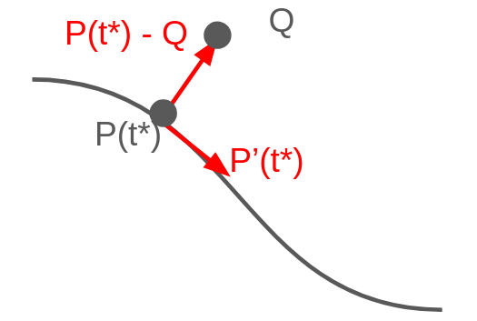

# Finding the closest point on a spline with linear extensions using Newton's method

## Closest point on the cubic to a query point

For a query point `Q`, the closest point on the curve satifies:

$$
f(t) = (P(t) - Q) \cdot P'(t) = 0
$$

`f(t)` doesn't have a convenient closed-form root, but Newton's method
converges to one in a handful of steps given a decent starting guess:

$$
t_{n+1} = t_n - \frac{f(t_n)}{f'(t_n)} = t_n - \frac{(P(t_n) - Q) \cdot P'(t_n)}{P'(t_n) \cdot P'(t_n) + (P(t_n) - Q) \cdot P''(t_n)}
$$

each step clamped back into `[0, 1]`, since a segment only exists on that
range.

To avoid getting stuck at a local minima, run Newton from six different starting points per segment (t = 0, 0.25, 0.5, 0.75, 1, plus a guess proportional to where the query's x falls)

## Distance from a ray to a query point

For the linear extensions at the spline ends, each is a straight
ray starting at the spline's first or last control point, continuing in the
direction of the curve's tangent there. The closest point on a ray to `Q` is
just a projection: project `Q − origin` onto the ray's direction to get how
far along the ray the closest point falls, then clamp that at zero so the
projection can't fall behind the ray's origin (the ray only extends outward
from the curve, it doesn't run back over it):

$$
\text{proj} = \max\left(0,\ \frac{(Q - \text{origin}) \cdot \text{direction}}{\text{direction} \cdot \text{direction}}\right)
$$

$$
\text{closest} = \text{origin} + \text{direction} \cdot \text{proj}, \qquad \text{distance} = |\text{closest} - Q|
$$

## Full answer

A fitted spline is several segments plus two straight-line extensions at the
ends (so the curve spans the data's full x-range). We check all of them and get the minimum.

